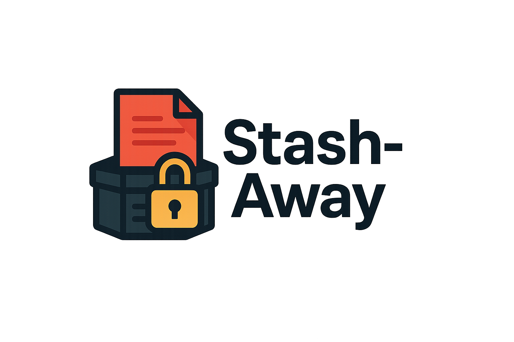

# Stash-Away



A lightweight CLI tool for backing up your Git repositories to personal backup repositories or creating local archives. Perfect for developers who need to maintain personal backups of work projects or want to snapshot their progress without affecting the main repository.

## Features

- 🔐 **Multiple SSH Key Support**: Use different SSH keys for work and personal repositories
- 📦 **Git Repository Backups**: Push your entire project state to a separate backup repository
- 🗄️ **Local Archives**: Create compressed archives that respect `.gitignore`
- 📋 **Backup Management**: List, compare, and restore previous backups
- 🚀 **Standalone Executable**: Build once, use anywhere without Python dependencies

## Installation

### Option 1: Build from Source

1. Clone this repository
2. Install PyInstaller: `pip install pyinstaller`
3. Run the build script: `./build.sh`
4. Copy to your PATH: `sudo cp dist/stash-away /usr/local/bin/`

### Option 2: Use with Python

Run directly with Python 3:
```bash
python3 stash-away.py <command>
```

## Usage

### Interactive UI (NEW!)

Launch the interactive text-based user interface:
```bash
stash-away ui
```

The TUI provides:
- Easy navigation with number keys
- Visual feedback with colors and panels
- Interactive prompts for all operations
- Status indicators and progress spinners
- Confirmation dialogs for sensitive operations

### Check Current Status

View your current backup configuration and repository status:
```bash
stash-away status
```

This shows:
- Current backup repository URL
- SSH identity file (if configured)
- Current branch and uncommitted changes
- Last backup information

### Initialize Backup Repository

Set up your backup repository URL:
```bash
# Basic initialization
stash-away init git@github.com:yourusername/my-backups.git

# With specific SSH key (for multiple GitHub accounts)
stash-away init --identity-file ~/.ssh/id_rsa_personal git@github.com:personal/backups.git
```

### Push Backup

Create a timestamped backup of your current project state:
```bash
stash-away push
```

This will:
- Stash any uncommitted changes
- Create a new branch named `backup/YYYY-MM-DD_HH-MM-SS`
- Commit all changes to this branch
- Push to your backup repository
- Clean up and return to your original branch

### Create Local Archive

Generate a compressed archive of your project:
```bash
stash-away archive
```

Creates: `stash-away-backup-YYYY-MM-DD_HH-MM-SS.tar.gz`

### List Backups

View all available backups in your remote repository:
```bash
stash-away list
```

Output:
```
Available backups:
  - backup/2025-06-27_10-30-45
  - backup/2025-06-27_15-22-13
  - backup/2025-06-28_09-15-00
```

### Compare with Backup

See what has changed between your current state and a backup:
```bash
stash-away diff backup/2025-06-27_15-22-13
```

### Restore Backup

Restore a previous backup to a new local branch:
```bash
stash-away restore backup/2025-06-27_15-22-13
```

This creates a new branch `restore/2025-06-27_15-22-13` with the backup contents.

## Common Use Cases

### Backing Up Work Projects to Personal Repository

When working on client projects where you can't push experimental code:

1. Initialize with your personal backup repo and SSH key:
   ```bash
   stash-away init --identity-file ~/.ssh/id_rsa_personal git@github.com:myuser/client-backups.git
   ```

2. Regularly backup your progress:
   ```bash
   stash-away push
   ```

3. Compare current work with yesterday's backup:
   ```bash
   stash-away list
   stash-away diff backup/2025-06-27_17-30-00
   ```

### Creating Regular Snapshots

Set up a cron job or alias for regular backups:
```bash
# Add to your .bashrc or .zshrc
alias backup='stash-away push && stash-away archive'
```

### Emergency Recovery

If something goes wrong with your main branch:
```bash
# List recent backups
stash-away list

# Check what was in the last good backup
stash-away diff backup/2025-06-27_09-00-00

# Restore it to a new branch
stash-away restore backup/2025-06-27_09-00-00
```

## How It Works

1. **Configuration**: Stores backup URL and SSH key path in your project's Git config
2. **Isolation**: Creates temporary branches for operations without affecting your work
3. **Security**: Uses your specified SSH key for all backup operations
4. **Clean**: All temporary branches are cleaned up automatically

## Requirements

- Python 3 (for running from source)
- Git
- SSH access to your backup repository
- PyInstaller (only for building standalone executable)
- Rich library (for TUI mode): `pip install rich`

## Building

To create a standalone executable:
```bash
./build.sh
```

This creates a self-contained binary in `dist/stash-away` that can be run without Python.

## Configuration Storage

Settings are stored in your project's Git configuration:
- `backup.url` - The backup repository URL
- `backup.identityFile` - The SSH key path (optional)

View current configuration:
```bash
git config --get backup.url
git config --get backup.identityFile
```

## Security Notes

- SSH keys are never copied or transmitted
- The tool only modifies the backup repository, never your main remotes
- All operations use Git's native security features
- Backup branches are isolated from your main development

## License

This project is provided as-is for personal use.

## Contributing

Feel free to fork and modify for your own needs. This tool is intentionally kept simple and self-contained in a single Python file for easy customization.